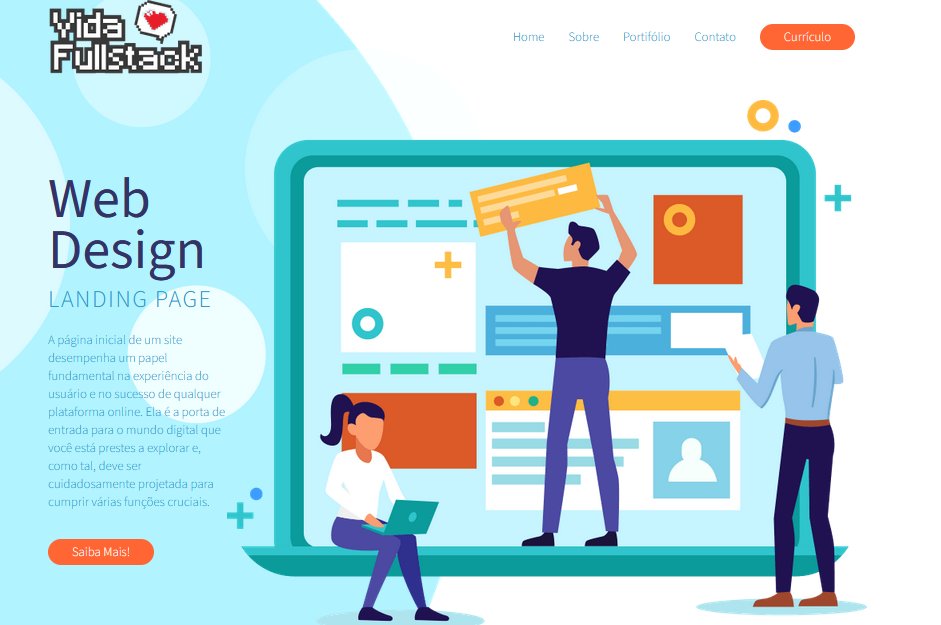
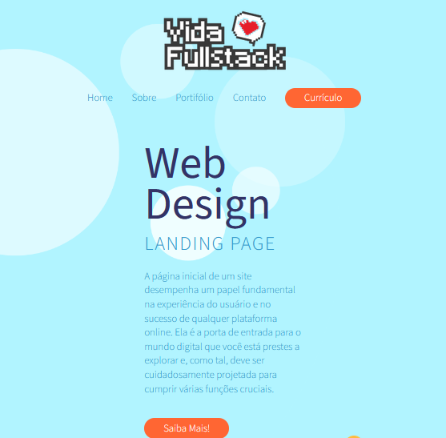
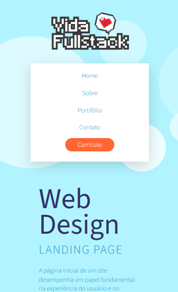

# Projeto Front-End

Primeiro projeto utilizando a linguagem de marcação HTML e a linguagem de estilo CSS 
https://breimberg.github.io/Projeto_Front/

#

# Resultado

  
As imagens a seguir são baseadas na criação de um site responsivo. O objetivo era entender como são feitas as alterações para alguns estilos de tela.  

#### Tela: @media (max-width: 915px)
  

#### Tela: @media (max-width: 450px)

#

# REFERÊNCIA
Projeto elaborado durante o curso livre [Jornada Front-End](https://www.youtube.com/watch?v=j_lSgjAODos&list=PLMy95_4XE08MRsQvaSQnHzyooNevGTNtS) no [Youtube](https://www.youtube.com/).
